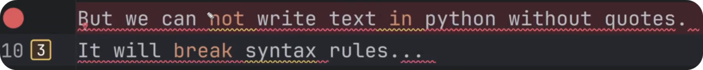
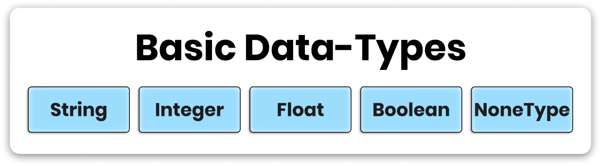

# What is Syntax?
Syntax is like a grammar of programming languages. And if you don't follow it, then Python won't understand you and you'll get an error.

But don't worry - Errors are you best teachers. They'll let you know exactly where and what went wrong so you can go and fix it. And hopefully learn along the way.

# Basic Data-Type: Strings
Let's begin exploring syntax rules with **String Data-Type**, which refers to text.

To create strings we need to use 'single' or "double quotes" on each side of the message. That's a syntax rule for strings.

~~~py
'Text in python is called String'
"It has to be inside single or double quotes"
'We can use "double-quotes" inside single quotes'
"And 'vice-versa' " # This is a string
~~~

⚠️However, keep in mind we can't write text without quotes. This will break python syntax rules, and it will certainly lead to many errors.

Also notice that certain words are highlighted (not, in, break).
There are certain keywords in Python with a special meaning to create Logical Statements, Loops, Functions and use other concepts (More on that later...).

# # Comments in Python
While coding you might leave some remarks of a piece of code that should be ignored by Python. And we can use **Comments** for that.

To create a comment put # symbol and then python will ignore everything on the right side of it. You can even put comments after your statements:

~~~py
"And 'vice-versa' " # this is a string

# But we can not write text in python without quotes.
# It will break syntax rules
~~~

As a beginner use comments to document your code and explain what's going on. No need to write an essay, but it's great to leave quick comments everything.

It's very common for beginners to write code, and then come back a few days/weeks later and forget what's going on. Comments can remind you most important parts. So leave comments to help your future-self or at least organize your code to be more readable.

# Variables: How to Store Data?
In python you can't write your data anywhere you want. You need to assign your data to containers called **'Variables'**. Think of it as a box that can store your data (text, numbers, lists...)

It's needed so you can define your data once and then reuse it many times in your code, always referring to the same data. You can also override the data if you need to.

To create a variable write a single word (without quotes) and then assign data with = equal sign. Later you can use the same variable name to access this data.

For example, you can print the data that variables hold like this:

~~~py
#📦 Text Variables
#--------------------------------------------------
text   = 'Text in python is called String'
text_2 = "It has to be inside single or double quotes"
text_3 = 'We can use "double-quotes" inside single quotes'
text_4 = "And 'vice-versa' " # This is a string

#👀 Print Statements
#--------------------------------------------------
print(text)
print(text_2)
print(text_3)
print(text_3)
~~~

P.S.
Make sure you don't use variable names with internal meaning in Python. This will override this meaning and you can break your Python. You might not know all the names yet, but you'll learn them as you progress during this course.

# All Basic DataTypes

~~~py
# Basic Data-Types in Python
#--------------------------------------------------
string    = 'text'
num_int   = 10
num_float = 3.14
boolean   = True #False
none_type = None
~~~

As you can see they are very simple. These are the building blocks for any script logic you'll want to create.

# Check Variable Types
As you code sometimes you might need to verify the type of your variables. And for that we can use type() built-in function. You can provide any object and it will return its type.

So to display in the console we also need to print() it, and here's how to combine both of them:

~~~py
print(type(string))      # <class 'str'>
print(type(num_int))     # <class 'int'>
print(type(num_float))   # <class 'float'>
print(type(boolean))     # <class 'bool'>
print(type(none_type))   # <class 'NoneType'>
~~~

Usually you'd do that during development, and then you'd comment it out once your code is complete.

# Simple Exercise
Lastly, let's have an example of how we could use variables to make our life easier.

Imagine you have a simple story:

~~~py
print('Once upon a time, there was a Revit User named Erik')
print('Erik has spent months on soul-draining tasks in Revit')
print('Until one day Erik said: Enough!')
print('And by accident he discovered that he could automate his Revit work with python')
print('But Erik knew nothing about python.')
print('And so, Erik has begun his programming journey.')
~~~

Now you decide to change user name and the app.  But doing it manually is prone to errors and not very efficient...

So instead, define variables once, and then use them inside your print statements. And if you decide to change the name or app, you have to make change only in one place. And to do that you can join multiple pieces of text including your variables.

Like this:

~~~py
# 💪 Simple Excercise
#--------------------------------------------------
user = 'Klaus'
app  = 'Photoshop'

print('Once upon a time, there was a' + app + 'User named ' + user)
print(user + ' wasted months on soul-draining tasks in ' + app )
print('Until one day' + user + ' said: Enough!')
print('And by accident he discovered that he could automate his' + app +  ' work with python')
print('But ' + user + ' knew nothing about python.')
print('And so, ' + user + ' has begun his programming journey.')
~~~

Now we're joining multiple strings into one using our variables. But we can agree on one thing:

🤬 It looks Horrible, isn't it?

It's fine to use + symbol to join strings on smaller examples, but in this case it's best to use string-formatting. Here's how.

# String Formatting
Instead of joining strings one by one, we can use string-formatting.

It's a way to put placeholders {} inside your strings and then replace them with actual values. And there are 2 ways to do that, depending if you're on an old version of python or newer than 3.6.6+.

Here's an example of both options:

~~~py
name = 'Erik'
age  = '29'

# After python 3.6.6 - f-string or .format()
print(f"My Name is {name} and I'm {age} years old")

# Before Python 3.6.6 - .format()
print("My Name is {} and I'm {} years old".format(name, age))
~~~

Both examples will produce the same result, but one is a bit simpler than the other. But notice how much simple and easier it is to insert your data in the middle on a sentence no w.

Now let's apply it to our story:

~~~py
# 💪 Simple Excercise
#--------------------------------------------------
user = 'Klaus'
app  = 'Photoshop'

print(f'Once upon a time, there was a {app} User named {user}')
print(f'{user} wasted months on soul-draining tasks in {app}')
print(f'Until one day {user} said: Enough!')
print(f'And by accident he discovered that he could automate his {app} work with python')
print(f'But {user} knew nothing about python.')
print(f'And so, {user} has begun his programming journey.')
~~~
