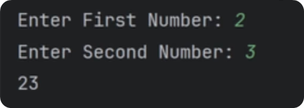
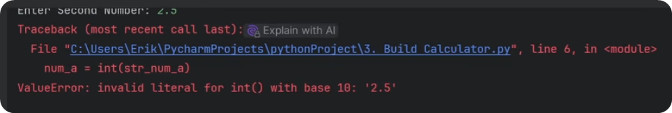

# Simple Exercise: Calculator

Let's practice and create a simple calculator.

The goal is to ask user to provide us numbers and then we'll join them and report the results in the console. I know it sounds too simple, but there is a tricky part that makes it a great excercise. 

So let's dive in.

# How To Get User Input?
To ask user for an input we can use built-in function called **input()**.

Since it's a function we need to use its name and then place parenthesis **( )** for any arguments. Sometimes functions don't need any arguments, or can even have multiple of them. In case of **input()** we need to provide a string message that user will see in the console.

Also, keep in mind that user input will be returned as string. This will be an important point in a moment. So let's try to get 2 numbers and add them together.

Like this:

~~~py
num_a = input("Enter First Number: ")
num_b = input("Enter Second Number: ")

total = num_a + num_b
print(total)
~~~

Now if you run this code you will notice that you need to provide input in the console. I will provide 2 and 3. And then we can see we printed the total value as 23.

Hold on a second, 2+3 is not equal 23. What's going on?

Remember I mentioned that **input()** returns string? So we aren't making an arithmetic math here... We're just adding 2 strings together. Similar to ab + cd = 'abcd'.

So if we want to do math, we need to convert our strings to numbers first. That's why it's important to know types of your variables in python. And if you're unsure, you can always double check with another built-in function called **type()**.

# How To type() ?
The **type()** function takes any object in your code as an argument, and it returns the class of that object. 

It's great to use during development if you get confused. It can also be used for logical statements to avoid issues, but more on that later in another lesson.

For now, here's simple example how to print the type of your variables:

~~~py
# 📦Random Values
num_a = "10"
num_b = 20
list_nums = ["10", 20]

# 🔎Check Types
print(type(num_a))
print(type(num_b))
print(type(list_nums))
~~~

# Convert Types in Python
So, we know that we get strings from the **input()** function. But we need to convert it into integer or float  to do some math.

To convert or create types in Python we need to use special built-in functions for each type. They either create default value, or convert the value you provide from other types, if it's logically possible.

## The functions:
~~~py
str() # Create an empty string "" or convert a value into a string

int() # Create 0 or convert a value into an integer 

float() # Create 0.0 or convert a value into a floating-point number

bool() # Create False or convert a value into True/False

list() # Create [] or convert an iterable into a list

tuple() # Create () or convert an iterable into a tuple

set() # Create empty set or convert an iterable into a set (unique elements)

dict() # Create empty dict or convert a mapping/sequence of pairs into a dictionary
~~~

In our case, we want to convert strings into integers, so we need to use **int()** function. Here's how it works:

~~~py
# 🙋‍♂️Get User Input
str_num_a = input("Enter First Number: ")
str_num_b = input("Enter Second Number: ")

# 🔁Convert String to Int
num_a = int(str_num_a)
num_b = int(str_num_b)

# 🧮Calculate Total
total = num_a + num_b
print(total)
~~~

This time if you run your code and provide 2 and 3 you will get 5 as total. 
So this time we are actually doing math!

# Floating numbers
But what if we decide to add floating numbers like 2.5 + 2.5 ?

Alright, so we can't convert "2.5" into an integer…  But what about converting into a float number? (float is a number with decimal point e.g. 3.14 )

~~~py
# 🙋‍♂️Get User Input
str_num_a = input("Enter First Number: ")
str_num_b = input("Enter Second Number: ")

# 🔁Convert String to Int
num_a = float(str_num_a)
num_b = float(str_num_b)

# 🧮Calculate Total
total = num_a + num_b
print(total)
~~~

This time 2.5 + 2.75 = 5.25 . It works, we're back to real science💥!

# Examples
Alright, let's go through multiple examples quickly, so you get an idea of what's going on when you convert your basic data types. I highly recommend you to copy these examples and run codes yourself.

~~~py
# Numbers
x          = 10
str_x      = str(x)       # Convert integer to string: '10'
float_x    = float(x)     # Convert integer to float: 10.0
bool_x     = bool(x)      # Convert integer to boolean: True (non-zero is True)
bool_neg_x = bool(0)      # Convert 0 to boolean: False

# Strings
s          = "123"
int_s      = int(s)       # Convert string to integer: 123
float_s    = float(s)     # Convert string to float: 123.0
bool_s     = bool(s)      # Convert  string to boolean: True (if not empty)
bool_empty = bool("")     # Convert empty string to boolean: False

# Booleans
bool_true  = bool(1)       # True
bool_false = bool(0)      # False
bool_list  = bool([])      # Convert empty list to boolean: False
bool_dict  = bool({})      # Convert empty dict to boolean: False
bool_str   = bool("Hello")  # Convert non-empty string to boolean: True
~~~

By now you should have a good understanding of basic data types in python and how to control them. It's very crucial to keep track of what data type is your data, so you can provide correct arguments later on.

And as you've seen with our simple calculator, if you forget to convert strings to numbers, you might have a faulty calculator.