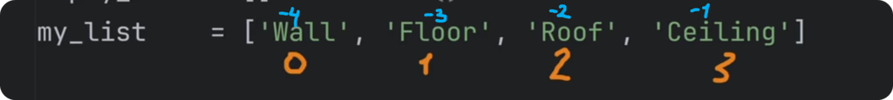
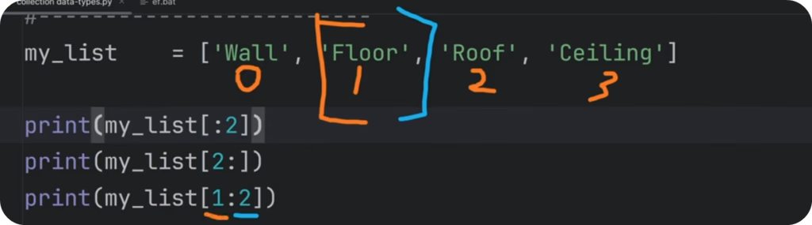
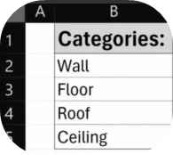
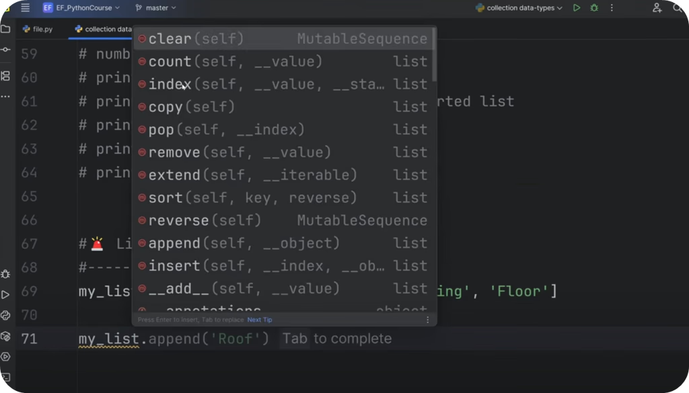
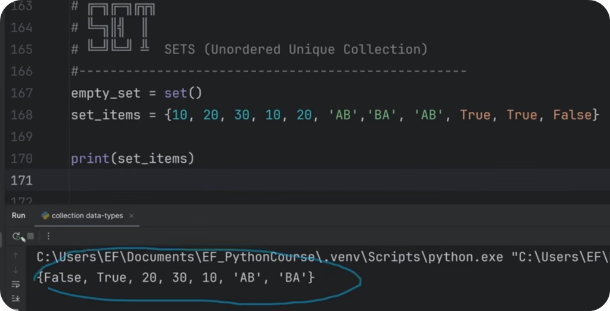
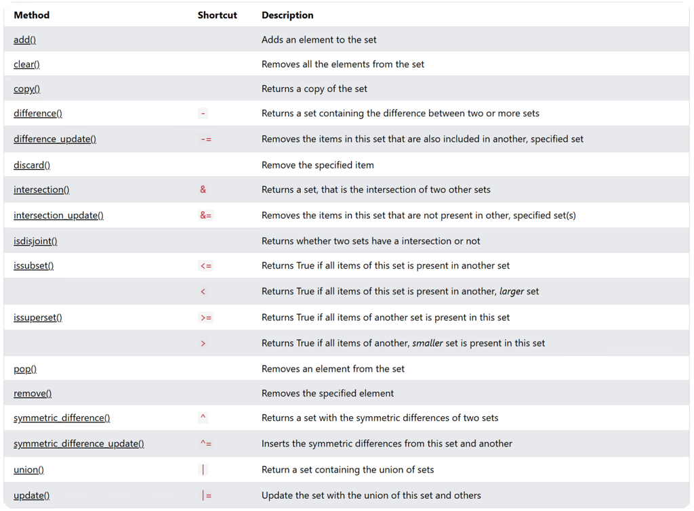
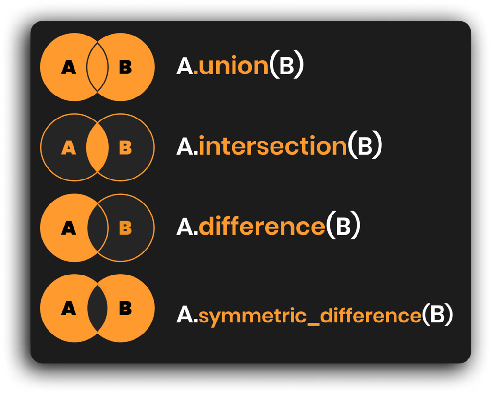
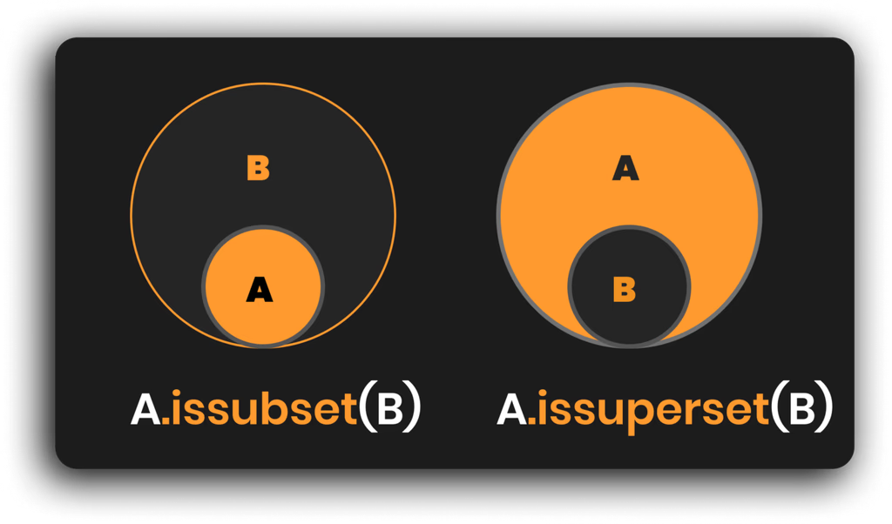
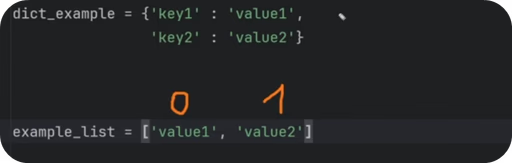

# Collection Data-Types:
So far you know how to create variables and store simple data ( **var = 'Text'** ). But  you'll also want to store more than a single value, that's where Collection data types come in such as:

~~~py
#📦 Collection Data-Types in Python (List | Tuple | Set | Dictionary)
#--------------------------------------------------------
# 🔹List  |         | Mutable   | Ordered   | Collection | ⭐ 90%+
# 🔹Tuple |         | Immutable | Ordered   | Collection |
# 🔹Set   | Unique  | Mutable   | Unordered | Collection |
# 🔹Dict  | Mapped  | Mutable   | Ordered*  | Collection |
#--------------------------------------------------------
~~~

In case you wonder:
>**Mutable**     - You can make changes.  
>**Immutable** - You can NOT make changes (it's fixed data).

We're going to cover all of them, but keep in mind that you'll use Lists in 90-99% of the time, so we'll focus the most on them so you know how to get the most out of them.

# 1️⃣ List (Mutable Ordered Collection)  - ⭐MOST USED
Let's start with the basic syntax of Lists.

To create a list we need to use square brackets **[]**, and separate all items inside with commas **[1,2,3]**. Also, we can put any data-types inside (text, int, float, bool, none-type, other lists, tuples... Anything!) 

Here's example:

~~~py
#📜 Basic Syntax
#-------------------------
empty_list = [] # or list()
my_list    = ['Wall', 'Floor', 'Roof', 'Ceiling']

print(my_list)
~~~

# 🔹List - Get Single Item
Firstly, let's look how to get items out of the list. 

Lists are ordered collections, so each item has a fixed index position that can be used to get the data out of the list. Use a variable name of a list and put square brackets with the index number  (e.g. **my_list[1]**)   

Here's Example:

~~~py
#👉 Get Single List Item
#-------------------------
print(my_list)
print(my_list[0])  # First Item (count starts from 0)
print(my_list[2])  # Third Item (count starts from 0)
print(my_list[-1]) # Last Item
print(my_list[-2]) # Second Last Item
print(my_list[100]) #IndexError: list index out of range
~~~

### 💡Also a few important notes:
>🔹In programming we start count from 0, not 1!  
>🔹We can get items from the end with negative index starting -1  
>🔹You'll get IndexError if index is out of range

⌨️ Use CTRL + / to comment out large section of the code, and let's move on.

# 🔹List - Slicing (Get Multiple Items)
You can also use **Slicing** if you want to get multiple items from a list. It allows you to get a chunk of data by specifying **Start, End or Step** positions. (e.g. **my_list[start:stop:step]**). And you don't have to specify all of them at once.

Here are examples:

~~~py
#✂️ Get Multiple Items (Slice)
#-------------------------
my_list    = ['Wall', 'Floor', 'Roof', 'Ceiling', 'Wall', 'Floor', 'Roof', 'Ceiling']
print(my_list[:2])      # Get Until 2nd Item (excl)
print(my_list[2:])      # Get From 2nd Item (incl)
print(my_list[1:3])     # Get From First(incl) until Third (excl)
print(my_list[::2])     # Get Every 2nd item
print(my_list[2:6:2])   # Get Every 2nd Item from 2nd (incl) until 6th (excl)
print(my_list[::-1])    # Trick to Reverse List
print(my_list[:])       # Same List Copy
~~~

### 💡Keep in mind **START is including and END is excluding**.

# 🔹List - Slicing Example
In case you wonder: _"why would I want to slice my lists?_"

Imagine you have a list of data representing a column in Excel. The first item is the header so it might be necessary to separate it from the data to apply different styling.

In this case we could use Slicing like this to separate header and data:

~~~py
# Slicing Use-Case Example
#-------------------------
my_list = ['Categories', 'Wall', 'Floor', 'Roof', 'Ceiling']
header  = my_list[0]
data    = my_list[1:]
print(header)
print(data)
~~~

# 🔹List - Replace List Items
Lists a mutable objects, meaning we can make changes.

And to override any value, we can specify it's index (position) and assign any new data with an equal sign =.

Example: 

~~~py
#👉 Replace Items
#-------------------------
my_list    = ['Wall', 'Floor', 'Roof', 'Ceiling']
my_list[2] = 'NewItem'
my_list[-1] = 'LastItem'
my_list[1:3] = ['a','b']
print(my_list)
~~~

# 🔹List - Membership Operators
We can also check if something is inside our lists. This is a very common and important step when you start creating logic in your python code (_more on that in another lesson_).

To check if something is inside, we can use in or not in operators and this will produce a boolean result like True/False.

~~~py
#🔎 Membership Operators (Necessary for Logic)
#-------------------------
my_list = ['Wall', 'Floor', 'Roof', 'Ceiling']

print('Wall' in my_list)
print('wall' in my_list)
print('Door' not in my_list)
~~~

### 💡 IMPORTANT: lower and UPPER case letters are not the same in Python, so wall is not the same as Wall.

On top of that, we can also check if content is equal == or not equal != :

~~~py
#🔎 Equal Operators (Necessary for Logic)
#-------------------------
my_list  = [10, 20, 30]
my_list2 = [10, 20, 30, 40]

print(my_list == my_list2) # False 
~~~

# 🔹List - Popular Functions
>**Function in Python is a reusable piece of code that performs a certain action.**

We'll cover all Python functions and how to create custom ones in other lessons, for now let's keep it simple and look at the most popular built-in functions for working with lists:

~~~py
#⚙️ Popular Functions with Lists
#-------------------------
my_list = ['Wall', 'Floor', 'Roof', 'Ceiling']
numbers = [10, 30, 20, 50, 40 ]
print(len(my_list))     # Get Length             >(5)
print(sorted(my_list))  # Create new sorted list >[10,20,30,40,50]
print(sum(numbers))     # Sum Numbers            >(150)
print(min(numbers))     # Get Min Value          >(10)
print(max(numbers))     # Get Max Value          >(50)
~~~

# 🔹List - Methods (Built-In Functionality)
Now, let's look deeper into Lists and check additional functionality that we get with methods.

>**A Method In Python - is a function associated with an object that create action or modifies the object itself.**

While functions are standalone, methods are tied to data-types, and we can use them by adding a dot after variable name and choosing the right method.

💡There are **11 Methods** in Lists to choose from. Some require argumernts while others don't need any additional input.

❌ Also, **Ignore Dunder (double-underscore) methods**, because they're made for python's internal functionality.

Here is a quick code example of all List Methods:

~~~py
# Lists
#-------------------------
my_list = ['Wall', 'Floor', 'Roof', 'Ceiling', 'Floor']
my_list2 = ['Door', 'Window']

#🚨️ List Methods (Built-In Functionality)
#-------------------------
my_list.append('Door')        # Add Single Item
my_list.extend(my_list2)      # Join 2 Lists
my_list += my_list2           # Join 2 Lists
my_list.sort()                # Sort List Alphanumerically
print(my_list.count('Door'))  # Count value inside list
print(my_list.index('Roof'))  # Find index of value
my_list.insert(2,'Sofa')      # Insert Item at certain Index
my_list.remove('Floor')       # Remove Value from List (if possible)
item = my_list.pop(2)         # Remove and Return Value at given Index (last by default)
my_list.reverse()             # Reverse List Order
my_list.clear()               # Clear all items from list
y = my_list.copy()            # Create independant copy of a list!
~~~

💡That might look like a lot to take in, but don't worry. You just need to know that methods exist and remember what kind of actions they make. Then you can always look it up when you need it.

# 🔹List - Nested Structure
I also want to show you an example of a Nested List Structure. 

Nested List - is a list that contains other lists as its elements. It is often used to represent 2D data, such as tables,  grids and so on...

It functions the same, but you just have multiple layers to go into. Think of it as Russian Matroshka Doll 🪆.

Here's an example of a list that contains nested lists representing XYZ Points.

~~~py
#📂 Nested Lists
#-------------------------
points = [
    [0,0,0],
    [2,2,0],
    [4,4,0],
    [6,6,0],
]

#🔎 Read Data
#-------------------------
pt2 = points[1]
print(points[1][2])
print(pt2[0], pt2[1], pt2[2])
~~~

Don't overthink it. Nested lists are just a way to better organize your data. You'll know exactly when you need to use them.

# 🔹List - For Loops 
Lastly, I have to mention loops. 

### 💡Loops are one of the most important Python concepts that allow you to execute the same piece of code on each item in a collection.

Don't worry, we'll have a full lesson about loops a bit later so you better understand how to work with them, but I want to briefly mention a quick example now that you could try with lists.

~~~py
#➿ Loops (More in Another Lesson!)
my_list = ['Wall', 'Floor', 'Roof', 'Ceiling']

for i in my_list:
    print(i)
    print(i)
    print(i)
~~~

In a nutshell: We use for i in collection:  syntax to create a loop and then everything we put under it (code-block) will be executed for each item. 

In this case, we'll **#print each item** x3 times.

## 🔹List - Remarks
And that's the main functionality of Lists in Python.

There were quite many topics, but don't worry, each one of them is very simple on its own. And you'll get more comfortable along the course as you start practicing more.

>For now your goal is to remember what's possible and you can always come back and reference the code of how to do it.

# 2️⃣ Tuples (Immutable Ordered Collection) 

Now let's talk about Tuples which are created with parenthesis (). 

>**Tuples are basically same as lists, but immutable**. So it means that you **can't make any changes** to tuples after you made them. So, why do we need them?

Since tuples are **immutable**, they have **less functionality** and therefore they are **more memory efficient** and can **execute faster**. However, this only makes sense on crazy big data sets like millions or billions of rows of data. (Think of some financial transactions data or large data sets of coordinates). Then tuples can provide a noticeable performance boost. Otherwise lists are just fine.

Also, just because you can't change tuples, doesn't mean you can't create a new tuple with updated data... Just something to keep in mind.

Let's look at an example:

~~~py
# ╔╦╗╦ ╦╔═╗╦  ╔═╗╔═╗
#  ║ ║ ║╠═╝║  ║╣ ╚═╗
#  ╩ ╚═╝╩  ╩═╝╚═╝╚═╝ TUPLES (Immutable Ordered Collection)
#--------------------------------------------------
empty_tuple = () # or tuple()
list_data = [0,1,2,3,4,5,0,1,2,3,4,5]       # List Can Be Modified     (Mutable)
data      = (0,1,2,3,4,5,0,1,2,3,4,5)       # Tuples Can't be Modified (Immutable)
data_pts  = ((0,0,0), (1,2,3), (2,4,6))     # Nested Tuples Example
~~~

You'll see the same data wrapped as a list and tuple and the only difference is that you can modify list with methods to add/remove/modify data inside. 

Other than that functionality is very similar.

# 🔹Tuple - Get Single Item
Getting items from a tuple is exactly the same as from a list.

~~~py
#👉 Get Single List Item
#-------------------------
print(data[0])
print(data[2])
print(data[4])
print(data_pts[1])
~~~

# 🔹Tuple - Slicing (Get Multiple Items)
**Slicing** works also exactly the same as lists, you create square brackets **[ ]** and specify **[Start:End:Step]** values.

~~~py
#✂️ Get Multiple Items (Slice)
#-------------------------
print(data[:2]) # Get Until 2nd Item (excl)
print(data[2:]) # Get From 2nd Item (incl)
print(data[1:3]) # Get From First(incl) until Third (excl)
~~~

# 🔹Tuple - Replace Items (Not Possible)
Remember, tuples are immutable so you can't make any changes and therefore you can't replace data. 

However, you can create a new tuple and assign to the same variable...

~~~py
#❌ You Can't Change Tuple Item!
data[0] = 'New Value'
print(data)
~~~

# 🔹Tuple - Popular Functions
When it comes to functions they also work exactly the same as with lists because they work with all iterable objects. 

>### Iterable object is an object that can be iterated over. Like a sequence/collection of data.

Here's an Example:

~~~py
#⚙️ Popular Functions with Tuples
#-------------------------
data      = (0,1,2,3,4,5,0,1,2,3,4,5)       # Tuples Can't be Modified (Immutable)
print(len(data))            # Get Length
print(min(data))            # Min Value
print(max(data))            # Max value
print(sum(data))            # Sum Numbers
print(sorted(data))         # Create new sorted list
print(tuple(sorted(data)))  # Convert List Into Tuple
~~~

# 🔹Tuple - Methods (Built-In Functionality)
If you'd look into Tuple's methods, you'll realize that there are only 2 very simple methods available: count, index.  Tuples have limited functionality so they can store data more efficiently.

~~~py
#🚨️ Tuple Methods (Built-In Functionality)
#-------------------------
data      = (0,1,2,3,4,5,0,1,2,3,4,5)
print(data.count(3))
print(data.index(3))
~~~

# 🔹Tuple - Loops & Nested Structure
Also other concepts like Nested Tuples or Loops work exactly the same as with lists. But let's keep it simple and focus on the basics instead.

And that's the wrap on tuples.

# 3️⃣ Set - (Unordered Unique Collection)
Now let's look at the next data-type - **Set**.

>### 💡Set is an Unordered Unique Collection and it's great for getting rid of duplicates or when you need to compare 2 sets of data and quickly find the difference.

To create a set you can use curcly braces **{1,2,1}** and write your data separated by commas. All duplicates will be removed. If you want to create an empty set you have to use **set()** function because empty braces will create a **dict** instead of **set** (more on that later)..

Try this snippet:

~~~py
# SETS (Unordered Unique Collection)
#--------------------------------------------------
empty_set = set()
set_items = {10, 20, 30, 10, 20, 'AB','BA', 'AB', True, True, False}

print(set_items)
~~~

If you try to execute this code you'll notice that all duplicates were removed automatically. This is the main power of using **sets**, but not the only one.

# 🔹Set - Remove Duplicates Example
Let's look at a useful example for working with sets and lists.

Imagine you have a list of data, and you know that you might get some repeating data. To clean duplicates you can turn your list into a set and then back into a list.

list -> set -> list

This way you're going to get rid of all duplicates and turn it back into a list.

Try This:

~~~py
#🔎 Convert  List/Tuple
#-------------------------
list_data        = [1,2,3,4, 1,2,3,4]     # original list
set_data         = set(list_data)         # list -> set (remove duplicates)
unique_list_data = list(set_data)         # set -> list (make it list again)

# Print Results:
print(list_data)          #> [1,2,3,4,1,2,3,4] 
print(set_data)           #> {1,2,3,4}
print(unique_list_data)   #> [1,2,3,4]
~~~

As you can see it's very simple to get rid of duplicates. However remember that sets are not ordered collections so you might ruin the order of your list doing this.

# 🔹Set - Common Methods (Built-In Functionality)
Now, lets look deeper into sets and explore their methods (built-in functionality).

You'll notice there quite many methods and they can be split into 2 categories:

>🔹Regular Methods  
>🔹Comparison Methods

Let's start with regular methods that modify the existing set. It's very self-explanatory,.

Example:

~~~py
#🚨️ Set Methods (Built-In Functionality)
#-------------------------
items = {10, 20, 30, 'AB', 'BA', 'AB', True, True, True}

copy_set = items.copy()     # Copy the set
removed  = items.pop()      # Remove & return a random element
items.clear()                # Remove all elements
items.remove(3)              # Remove element (error if missing)
items.discard(3)             # Remove element (no error if missing)
items.add(10)                # Add a single element
~~~

# 🔹Set - Comparison Methods (Built-In Functionality)
Now let's look at **comparison methods** and it's the second big super power of sets.

You can take 2 Sets of data and compare to find **Intersection / Difference**...

And here is a code snippet so you could try it out yourself.

~~~py
#🆎 Set Methods: Compare Sets
#-------------------------
a = {1,2,3,4}
b = {3,4,5,6}

print(a.union(b))                # Join 2 Sets
print(a.intersection(b))         # Find Items in BOTH sets
print(a.difference(b))           # Set A items that are missing in set B
print(a.symmetric_difference(b)) # Symmetric difference between 2 sets
print(a.issubset(b))             # Is set a completely inside set b?
print(a.issuperset(b))           # Does set_a contain all from set_B?
~~~

Also notice the last 2 methods issubset, issuperset. These are a bit confusing but you just check if data in one set is completely inside another. And then you determine if it's a sub or super set.

# 🔹Set - Popular Functions
Similar to **Lists** and **Tuples** you can use the same popular functions.

~~~py
#⚙️ Popular Functions with Lists
#-------------------------
set_nums = {10, 30, 20, 50, 40 , 10, 20}

print(len(set_nums ))     # Get Length             > 5
print(sorted(set_nums ))  # Create new sorted list > [10,20,30,40,50]
print(sum(set_nums ))     # Sum Numbers            > 150
print(min(set_nums ))     # Get Min Value          > 10
print(max(set_nums ))     # Get Max Value          > 50
~~~

>💡 Just keep in mind that set will clean up all duplicates before you run any functions.

# 🔹Set - Loops
You can also create loops with sets and it works similar to lists and tuples. But let's ignore it for now, there will be a separate lesson for loops.

And that's a wrap on sets! 

# 4️⃣ Dictionary  (Mapped Ordered* Mutable Collection)
And the final collection data type is **Dictionary**.

>### Dictionary is a mapped ordered mutable collection. It means that it stores data as key-value pairs like a real dictionary where each word (key) has a meaning (value) and they are separated with a colon :

For example: Imagine that you've just heard a new word 'Defenestration' . Out of curiosity you decide to open up a dictionary (if you old enough to remember those) and look up the word definition. And there you'll find:

~~~py
{'Defenestration' : 'It is an act of throwing someone out of a window.'}
~~~

Python dictionaries are the same. You create a collection where you store **values** associated with specific **keys**. And it can be really useful to structure your data (think of JSON format).

Here's dictionary syntax basics:

~~~py
# Syntax
empty_dict   = {}                    # or dict()
dict_example = {'key1' : 'value1',
                'key2' : 'value2'}
~~~

💡 Notice that **dictionary** also uses curly braces {} like **sets**. This is because dictionary also can not contain duplicate keys. However, you need to store data in **dict** as pairs of **key-value** separated with a colon :

🤔 I know beginners often feel confused about dictionaries, so let's have a quick comparison with lists that usually helps a lot.

# 🔹Dict vs List Comparison
Let's quickly compare structure of a **List** and a **Dictionary**.

In lists you store single data values separated with a comma. However, remember that each item has a **positional index** starting count from 0 .

Dictionaries do not have **positional index**, because they use **custom keys** instead.

Theoretically, you could use integers as **keys** in a **dictionary** and it would mimic the structure of a **list**, but it would have different functionality associated with them.

~~~py
d1 = {'key1':'value1', 'key2':'value2', 'key3':'value3'}
d2 = {0:'value1', 1:'value2', 2:'value3'}
~~~

Let's look into dictionary's functionality.

# 🔹Dict - Get Items
Getting items from a dict is actually similar to tuples and lists, but instead of positional index we need to use the key of your items.

Let's define a better dictionary example. And notice that I put each pair on a new line, this helps keep your code more readable. Spacing is irrelevant as long as all pairs are between start/end curcly braces {}.

~~~py
#✨Better Example
data_types = {
    "int"     : "A whole number, like 1, 2, or 3.",
    "float"   : "A number that can have a decimal point, like 2.5 or 0.1.",
    "str"     : "Words or letters, like 'hello' or 'apple'.",
    "bool"    : "True/False. Similar to Yes/No parameter in Revit.",
    "list"    : "A group of things you can change, like [1, 2, 'apple'].",
    "tuple"   : "A collection of things you can’t change, like (1, 2, 'apple').",
    "dict"    : "Pairs of things, like {'name': 'John', 'age': 10}.",
    "set"     : "A group of unique things, like {1, 2, 3}. Duplicates ignored.",
    "NoneType": "Means nothing or empty, like an empty box."
}
~~~

And here's how to read values (multiple options):

~~~py
#🔎 Access Values
#-------------------------
print(data_types['dict'])                          # Classic getter
print(data_types['set'])                           # Classic getter
print(data_types.get('NoneType'))                  # Use Method to Get
print(data_types['Missing'])                       # KeyError: 'Missing'
print(data_types.setdefault('int', 'MyValue'))     # Use Default if Missing
~~~

# 🔹Dict - Add/Modify Data
**Dictionaries** are **mutable** collection, so we can make changes. 

To add or modify data we need to specify the **key** in square brackets and assign a new **value** like this: **my_dict['key'] = 'NewValue'** . This will either create a **new pair** in a dict or override existing **key-value**.

Code:

~~~py
#⚙️ Add/Modify Data
#-------------------------
data_types['int'] = 'Just a number'                # Modify Existing
data_types['complex'] = 'It is too complex...'     # New Pair

print(data_types)
~~~

# 🔹Dict - Membership Operators
We can also look inside our dictionaries and check if certain keys are already inside or not. It's important for creating conditional statements to create logic in our scripts (more on that in another lesson).

 Here's simple example:

~~~py
#🔎 Membership Operators (Necessary for Logic)
#-------------------------
print('list' in data_types)         # True
print('test' not in data_types)     # False 
~~~

# 🔹Dict - Popular Functions

Dictionary can also use the same popular functions because they work with all inerrable objects. However, make sure your keys support it (e.g. sum() only works on  numbers...)

>### Iterable object is a term for collection data types where you can iterate over items in a container. Think of List, Tuple, Set, Dict, String (sequence of characters...) and so on...

Therefore I'll only leave len() because it's most used with dicitonaries.

~~~py
#⚙️ Popular Functions with Dict
#-------------------------
data_types = {...}

print(len(data_types))
#... Others also work if data is right
~~~

# 🔹Dict Methods (Built-In Functionality)

Lastly, let's jump a bit ahead of ourselves so I can mention the **most used built-in methods** for dictionaries. They will help you extract the right data from a **dict** as a **list**:

>**.keys()** - Get List of all Keys in a dictionary  
>**.values()** - Get a list of all Values in a dictionary  
>**.items()** - Get a list of both Keys and Values as tuples.

Try this code snippet:

~~~py
#🚨️ Dict Methods (Built-In Functionality)
#-------------------------
print(list(data_types.keys()))      # Get list of Keys
print(list(data_types.values()))   # Get list of Values
print(list(data_types.items()))      # Get list of Key+Value Tuples
data_types.update(dict_example)
print(data_types.pop('bool'))
~~~

💡Don't worry if it feels like too much. I'm jumping ahead of myself so I can show you what's available and we're going to cover **Built-In methods** in another lesson in more detail.

# 🔹Dict - Loops
Lastly, I probably shouldn't show you loops yet, but I'll just leave this important code snippet so you know how to go over **Keys and Values** in a dictionary at the same time.

Again, we'll cover loops in **Lesson 09 - Loops in Python**, so please be patient for in-depth explanation of loops. 

~~~py
##➿ Dict Loops
#-------------------------
for k,v in data_types.items():
    print(k, '---', v)
~~~
And, that's a wrap on Dictionaries!

# Summary
And now you know about Collection Data-Types and how to use them. And remember, **you will use Lists 90%+**, so focus the most attention on them.

~~~py
#📦 Collection Data-Types in Python (List | Tuple | Set | Dictionary)
#--------------------------------------------------------
# 🔹List  |         | Mutable   | Ordered   | Collection | ⭐ 90%+
# 🔹Tuple |         | Immutable | Ordered   | Collection |
# 🔹Set   | Unique  | Mutable   | Unordered | Collection |
# 🔹Dict  | Mapped  | Mutable   | Ordered*  | Collection |
#--------------------------------------------------------

my_list = [10,20,30,40,50]
my_tuple = (10,20,30,40,50)
my_set   = {10,20,30,10,20}
my_dict = {'key'  : 'value',
           'key2' : 'value2'
                }
~~~
