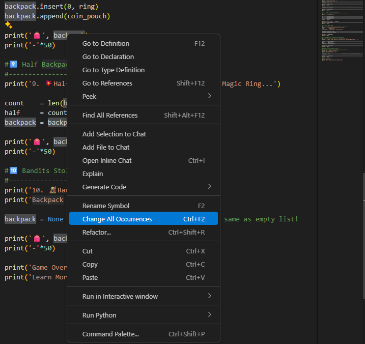

# Time to Practice
You've just learnt about collection data types in the previous lesson🥳.
So, let's make a simple exercise to practice lists (and a little bit of sets and dicts).

>### 👉 Quick note: we haven't covered logical statements and loops, which are super important concepts in Python. So we'll keep this lesson very simple and focus on the very basics of working with lists.

Here's the plan:
We're going to play a **Backpack Game** where we go through different steps and practice adding, removing, and modifying items in a list. This way you can sit back, relax and see how you can work with a single list and make all kinds of changes depending on the task.

So let's begin

# 0️⃣ How To Begin The Game?
We begin this journey with an empty backpack (a simple list) and we'll carry it along the whole game by making different changes depending on the task.

As I've mentioned, it'll be a very abstract game because we don't know enough Python yet, but it will be fun and help you practice working with lists early on.

So, let's get you a backpack🎒!

~~~py
#0️⃣ Start Backpack Game
#--------------------------------------------------
backpack = []
print('0. 🙂Starting Journey with Empty Backpack.')

print('🎒', backpack )
print('-'*50)
~~~

~~~
0. 🙂Starting Journey with Empty Backpack.
🎒 []
~~~

# 1️⃣ Pick up Starter Kit Items.
You're given a StarterKit that contains 'Armor', 'Shield', 'Sword', 'Potion'. 
Pick them up by adding these words to your backpack-list.

>### Add Items from StarterKit to Your Backpack one by one.

~~~py
#1️⃣ Pick up StarterKit Items.
#--------------------------------------------------
print('1. 📦 Picking Up StarterKit (Armor, Shield, Sword, Potion).')
backpack .append('Sword')
backpack .append('Armor')
backpack .append('Shield')
backpack .append('Potion')

print('🎒', backpack )
print('-'*50)
~~~

~~~
1. 📦 Picking Up StarterKit (Armor, Shield, Sword, Potion).
🎒 ['Sword', 'Armor', 'Shield', 'Potion']
~~~

# 2️⃣ Loot a Chest
You've just found a treasure chest: ['Map', 'Potion', 'Compass', 'Potion'] .
You can pick all these items and add them to your backpack.

>### Add items from chest to your backpack (without append)

~~~py
#2️⃣ Loot a Treasure Chest
#--------------------------------------------------
chest     = ['Map', 'Potion', 'Compass', 'Potion']
backpack += chest

print('2. 🎁Looting a Treasure  Chest!')
print(f'Chest: {chest}')

print('🎒', backpack )
print('-'*50)
~~~

~~~
2. 🎁Looting a Treasure  Chest!
Chest: ['Map', 'Potion', 'Compass', 'Potion']
🎒 ['Sword', 'Armor', 'Shield', 'Potion', 'Map', 'Potion', 'Compass', 'Potion'
~~~

# 3️⃣ Visit Merchant
We're visiting a merchant and we see a shiny 'Magic-GreatSword'. We want that!
Merchant says that we can exchange our Shield and current Sword for this new Magic-GreatSword. Let's do it.

>### Remove 'Shield' from list
>### Replace 'Sword' to 'Magic-GreatSword'

~~~py
#3️⃣ Visit Merchant.
#--------------------------------------------------
print('3. 🧙‍♂️ Visiting Merchant')
print('- Selling the Shield.')
print('- Upgrading Sword -> Magic GreatSword')

backpack.remove('Shield')                    # Remove Shield
inx            = backpack .index('Sword')    # Find Sword Position
backpack [inx] = 'Magic-GreatSword'          # Change Sword at any index

print('🎒', backpack )
print('-'*50)
~~~

~~~
3. 🧙‍♂️ Visiting Merchant
- Selling the Shield.
- Upgrading Sword -> Magic GreatSword
🎒 ['Magic-GreatSword', 'Armor', 'Potion', 'Map', 'Potion', 'Compass', 'Potion'
~~~

# 4️⃣ Inventory Check
We've collected quite a few items and even changed things. Let's double check what we have:

>### Count Total Items
>### Count Unique Items
>### Count amount of 'Potion' in the Backpack.

~~~py
#4️⃣ Check Inventory
#--------------------------------------------------
print('4. 🔎Checking Backpack: ')
print('🎒', backpack)

total_count   = len(backpack)
unique_items  = set(backpack)
unique_count  = len(unique_items)
potion_count  = backpack.count('Potion')

print(f'There are {total_count} Items in Total.')
print(f'There are {unique_count} Unique Items.')
print(f'There are {potion_count} Potions.')
print('-'*50)
~~~

~~~
4. 🔎Checking Backpack: 
🎒 ['Magic-GreatSword', 'Armor', 'Potion', 'Map', 'Potion', 'Compass', 'Potion'
~~~

# 5️⃣ Dropped The Backpack 🙃
Oh no, we've just dropped the backpack upside down. What happened to all our items?

>### Reverse the order of your backpack

~~~py
#5️⃣ Dropped the Backpack.
#--------------------------------------------------
print('5. 🙃Dropped the Backpack Upside-Down... ')
backpack.reverse()

print('🎒', backpack)
print('-'*50)
~~~

~~~
5. 🙃Dropped the Backpack Upside-Down... 
🎒 ['Potion', 'Compass', 'Potion', 'Map', 'Potion', 'Armor', 'Magic-GreatSword'
~~~

# 6️⃣ Sort Your Backpack
Let's fix the order of our backpack and sort it back using alphanumeric sorting rules.

>### Sort your backpack

~~~py
#6️⃣ Sorting Items
#--------------------------------------------------
print('6. ➡️Sorting Items: ')
backpack.sort()

print('🎒', backpack)
print('-'*50)
~~~

~~~
6. ➡️Sorting Items: 
🎒 ['Armor', 'Compass', 'Magic-GreatSword', 'Map', 'Potion', 'Potion', 'Potion'
~~~
By default the **sort()** function sorts alphanumerically. But we can also provide custom sorting rules by using key= parameters and providing another function. 

For example we can provide len() function name, to sort by the amount of letters in each word. And it can be any function, but it's a topic for another lesson!

Here's a simple example you can try:

~~~py
backpack.sort(key=len)

print('🎒', backpack)
print('-'*50)
~~~

~~~
6. ➡️Sorting Items: 
🎒 ['Map', 'Armor','Potion', 'Potion', 'Potion' 'Compass', 'Magic-GreatSword'
~~~

# 7️⃣ Stolen Items during Sleep
While we sleep somebody has come and taken 3 random items from our backpack!

>### Remove 3 items
>### Display a list of stolen items

~~~py
#7️⃣ 3 Items Stolen During Sleep
#--------------------------------------------------
print('7. 💤Sleeping...')

a      = backpack.pop()
b      = backpack.pop(2)
c      = backpack.pop()
stolen = [a,b,c]

print(f'Stolen Items: ', stolen)
print('🎒', backpack)
print('-'*50)
~~~

~~~
7. 💤Sleeping...
Stolen Items:  ['Potion', 'Magic-GreatSword', 'Potion']
🎒 ['Armor', 'Compass', 'Map', 'Potion'
~~~

# 8️⃣Found Magic Ring and Coin Pouch
We've just been robbed, but luck is on our side. we've just found a Magic Ring and a Coin Pouch. Let's pick the up and this time we're going to put the ring deep into our backpack.

>### Add Ring as the first item in a list ring = 'Magic-Ring'
>### Add nested list of coins in the end coin_pouch = ['Gold Coin', 'Silver Coin']

~~~py
#8️⃣ Found Magic-Ring
#--------------------------------------------------
print('8. 💍Found Magic Ring And Coin Pouch')
ring       = 'Magic Ring'
coin_pouch = ['Gold Coin', 'Silver Coin']

backpack.insert(0, ring)
backpack.append(coin_pouch)

print('🎒', backpack)
print('-'*50)
~~~

~~~
8. 💍Found Magic Ring And Coin Pouch
🎒 ['Magic Ring', 'Armor', 'Compass', 'Map', 'Potion', ['Gold Coin', 'Silver Coin'
~~~

# 9️⃣Half Backpack Disappears
The Magic Ring was activated and it disappeared taking half of the backpack with it. Damn you magic ring...

>### Remove the first half of items from the backpack  

~~~py
#9️⃣ Half Backpack Contents Have Teleported
#--------------------------------------------------
print('9. 💥Half Items Magically Disappeared. Damn You Magic Ring...')

count    = len(backpack)
half     = count // 2
backpack = backpack[half:]

print('🎒', backpack)
print('-'*50)
~~~

~~~
9. 💥Half Items Magically Disappeared. Damn You Magic Ring...
🎒 ['Map', 'Potion', ['Gold Coin', 'Silver Coin'
~~~

# 🔟 Bandits Attack
Bandits attack. We'd beat their asses, but we lost our Magic-Greatsword so we're at their mercy. And they really like our backpack so we have to let it go.

>### Get rid of Backpack

~~~py
#🔟 Bandits Stole Empty Backpack
#--------------------------------------------------
print('10. 🧌Bandits Attacked.')
print('Backpack Stolen...')

backpack = None                       # None is not the same as empty list! 

print('🎒', backpack)
print('-'*50)
~~~

# ☠️ Game Over
Not every game has a happy ending, but I hope you've gained some good practice and learned more about working with lists. There’s always a bright side to the coin🪙.

~~~py
print('Game Over')
print('Learn More Python To Fight Back!')
~~~

But let's look over the code and **Refactor** it to make it a bit better.

# What is Refactoring?

>### Refactoring means improving the code so it's cleaner, easier to read, and better to maintain while keeping the same functionality of the code.

It's a very important step after the first draft version of any script, which is often quick and dirty solution to begin with. It means rewriting parts of your code or even changin variable names and doc strings to better explain the login.

Sometimes it feels like this to refactor your code, but it's always worth it if you have time:

### What to do?

Look over your code and find if there's anything you could make better. And here's a great rule for programming:

### If you ever catch yourself copy-pasting the same code over and over - you're doing something wrong. Programming is all about being efficient and it includes writing clean code. Always look for ways to reuse your code without using CTRL+C, CTRL+V combo.

🔷For example we've copied print('-'*50)  too many times... 

And what if you want to change from 50 to 75? It would mean you have to update it everywhere manually. And later you might need to do it again... So not very efficient. Instead, we can create a single variable and reuse it everywhere

~~~py
dashes = '-' * 75

#...
print(dashes)
#...
print(dashes)
#... 
~~~

Now, we have a single control for all these print statements.

---
🔷Another example: we can improve variable names. We've create a backpack variable and used it everywhere. And to be fair it can be shorter without losing the meaning. why don't we rename it to pack instead?

Here's how to rename the same variable across the whole script or even project:

You can right click on a variable name and then select **Change All Occurences**. VS Code will update the name everywhere.

Alright enough with the lists.

# Simple Dictionary Example
Now before I let you go let's go over dictionaries quickly. They are often confusing to beginners because of lack of examples. And don't worry as you get better at programming you'll also get more comfortable working with dictionaries.

They can be used to create different kind of data structures. And as a beginner you can start using them for a simple mapped collection.

For example, think of a phonebook. Inside you'll find Names (keys) and Numbers(values) and they are related to each other. This is the perfect data structure to use dictionary for.

Let's try it: 

~~~py
# Dicitonaries
phonebook  = {'Ricky' : '+43 4111 5111',
              'Tommy' : '+43 4222 6222',
              'Klaus' : '+43 4333 7333'}             # Name : 'Number'

# Add More Items
phonebook['Erik']     = '+372 5555 5555'
phonebook['Kristina'] = '+372 5656 5656'
phonebook['Theo']     = '+372 5757 5757'

print(phonebook)

number = phonebook['Erik']
print(f'📞 Calling Erik... ({number})')

number = phonebook['Theo']
print(f'📞 Calling Theo... ({number})')

number = phonebook['Kristina']
print(f'📞 Calling Kristina... ({number})')
~~~
As you can see it makes a lot of sense to use here a dictionary to keep relations between phones and numbers and have an easy way to read this data.

Now, let's look at more advanced example:

# Dictionary - Advanced Example
Think of the backpack game we played earlier. It was fun and easy, but we didn't store a lot of data...  If we wanted to make a real game we'd need to come up with a better way to store and process our data related to the same object/player.

There are different ways to do that, and dictionary is one of them. To be honest, Classes would be a better approach because of how much more powerful they are (more on them later), but if you'd want to store data outside of Python script, you'd have to convert it to something like JSON format which uses the dictionary structure.

So, here's how we could use dictionary to create a Players Data Structure to store a lot of data related to the same object.

~~~py
#  DICTIONARY (Advanced)
player = {'Name'     : 'Erik',
          'Class'    : 'Warrior',
          'Health'   : 100,
          'Level'    : 1,
          'Backpack' : []
          }

# Modify Stats
player['Level'] += 1

# Add Items
player['Backpack'].append('Item-A')
player['Backpack'].append('Item-B')
player['Backpack'].append('Item-C')
player['Backpack'].append([10,20,30])

for k,v in player.items():
    print(k, v)
~~~

Notice that we have a dictionary that represents a player. And now we can store various attributes and even the backpack itself and it will remember all changes we make to any of these attributes. 

The syntax might become a bit more complex, but that's just the result of creating a more advanced data-structure. And now we can save this player dicitonary as a JSON format to store it somewhere else.

This is just an idea for you to help you understand how dictionaries can be used, especially if you think a bit more creatively about it. It's not only about making simple pairs of 2 words. It can include way more information inside and used in different ways.

Just give it time, you'll understand dictionary on another level.
