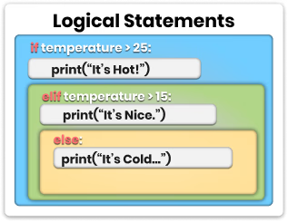
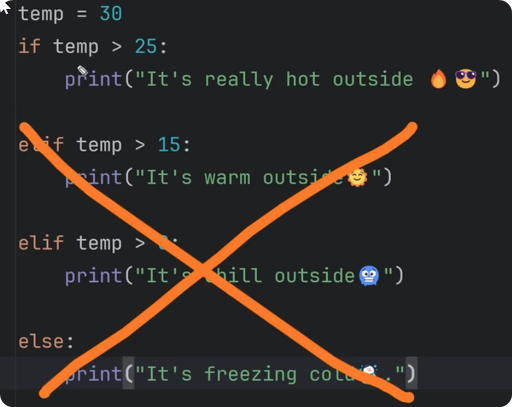
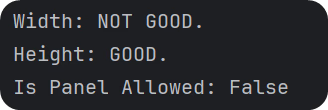

# Time To Add Logic!

It’s time we add logic to our python scripts which is essential for any code. You will often need to execute different code depending on your condition.

For example: If you want to learn more, continue watching. Else, skip to the next one. **Did you notice what I just did here?** I just created a logical statement.

Here's how it would look in code:

~~~py
want_learn_more = True

if want_learn_more:
    continue_watching()

else:
    skip_to_next()  

#PS This code won't execute because of missing functions. 
# It's just an abstract example of logic using pseudo code.
~~~

I’ve created an **if/else** statement to decide on a right action depending on the condition. That’s how we create simple logical statements in python. And don't worry, I will break it down in simple terms.

So, Let's dive into that.

# Basic Syntax of Conditional Statements
To create a logical statement in python we need to use the **if** keyword and then provide a **condition**. We will look into various conditions in a moment, for now let's use simple 5 > 0 condition, which always results in **True**.

Once you create an **if-statement** with a condition, then you have to end it with a colon :. After that you create a code block that will be executed if condition is True.

Here is a simple example

~~~py
if 5>0:
    print('Condition was True.")
~~~

Hold on, what is a **code block** and why are there 4 spaces/ 1 tab for the next line?

>### Code Block - is a piece of code that is grouped under certain statements (including if statements). Many programing languages use curly braces {} to define the Start and the End of the code block, however python uses indentation.
>### Identation - refers to the spaces or tabs at the beginning of a line of code. So in python all lines should be aligned to create a code block. Usually it's done with a single Tab or 4 spaces.

So, you create an if statement with a condition, and then your code block under it will only be executed if your condition come to True.

~~~py
if True:
    print('Condition was True.")
~~~

💡If condition results False, then you code block will never be executed. Python will skip it.

Also, keep in mind that when you create logical condition in python like 5>0, it results in either True/False. So if you would try to print it, you would just see a boolean.

That's important to know because you can also store that in a variable.

~~~py
condition = 5>0

if condition:
    print(condition) #True
~~~

You can read the code above as following:

condition is five is more than zero. If condition is True, then print condition itself.

# More Logical Statements
Logical statements in python always start with if keyword. However, you can also have additional statements to create more logical checks.

>**if** - Create first logical test  
>**elif** - Create More additional logical tests (optionally)  
>**else** - Define code to execute if no previous logical test were True.

In general, you always start with if statement and a condtion.
Then, you can create more conditions with elif for each. (elif is short for else if).
And lastly, you have an option to define code if there wasn't a single True condition.

💡Keep in mind that if you've created if/elif/else statements, only one will be executed, depending on the conditions. Once something came true then the rest will be ignored.

# Examples:
Only one code block can be executed if you use if/elif/else combination. Even if multiple can come to True, once the first one evaluates to True, its code block will be executed and all the rest will be ignored.

If you try the code, you will only see 'A' printed in the console.

~~~py
# Example A
condition  = True
condition2 = True

if condition:
    # Do action 🅰️
    print('A')
elif condition2:
    # Do action 🅱️
    print('B')
else:
    # Do something else
    print('C')
~~~

~~~py
# Example B
condition  = True
condition2 = True

if condition:
    # Do action 🅰️
    print('A')

if condition2:
    # Do action 🅱️
    print('B')
~~~

In the second example, both code blocks can be executed. Because each if statement is unrelated to another one. So no matter the results, both of these statements will be checked and code block executed if True.

If you try the code, you will see both 'A' and 'B'.

>### 💡 Don't overthink it. It's a simple concept once you use it a few times.

# Example 1 : if/elif/else Statements
Enough of the theory, let's experiment with logical statements. I recommend you to check the video about this example as I will write it out step by step.

In the written summary, I will provide you the whole snippet and then explain what's going on and why. Here is the snippet:

~~~py
temp = 30

if temp > 25:
    print("It's really hot outside 🔥😎")

elif temp > 15:
    print("It's warm outside🌞")

elif temp > 0:
    print("It's chill outside🥶")

else:
    print("It's freezing cold☃️.")
~~~

So, in this code you can see that we've defined our temperature as 30. And then we created multiple if/elif statements with different code blocks. However, only 1 code block will be executed, depending on the temp value.

The reason to use many elif statements instead of multiple if statements, is because you only want 1 result. If the temperature is 30, then you would only want the first code block to be executed. It can be evaluated to True in all 3 conditions. Once something is True, the rest will be ignored.

You could use multiple if statements, but your results would be very confusing. You would get Hot, Warm and Chill results on a single temperature. That's not what you expected, isn't it?

I recommend you to copy this snippet and change temperature and try experiments with if/elif to see the difference.

# Comparison Operators in python
Alright, let's go through various logical operators in python, starting with simple comparisons.

~~~py
# COMPARISON OPERATORS
equal           = 5 == 5 # True
not_equal       = 3 != 3 # False
greater_than    = 7 > 5  # True
less_than       = 7 < 5  # False
greater_than_eq = 5 >= 5 # True
less_than_eq    = 5 >= 6 # False
~~~

>### 💡 Notice that single equal sign = is used to assign data to a variable, while double equal sign == means equal comparison.

# Logical Operators (And/Or/Not)
Also, keep in mind that you can combine multiple conditions together wit And/Or logic. And it's pretty simple.

Here is the basic syntax:

~~~py
# LOGICAL OPERATORS
logical_and = True and True # True
logical_or  = True or False # True
logical_not = not True      # False
~~~

When you use:
>**and** - All conditions must be True  
>**or** - At least one condition must be True  
>**not** - Make opposite result (not True = False…)

# Example2: Combine Conditions
Let's create a simple example where we have 2 coordinates (XY), and we want ot make sure that both of them are between 0 and 100.

Here is how we could combine everything into a single line:

~~~py
X = 20
Y = 40

if X > 0 and X < 100 and Y >0 and Y < 100:
    print('XY Coordinate is good.')
~~~

We could also create many nested statements that would look something like this:

~~~py
if X > 0:
    if X < 100:
        if Y > 0:
            if Y < 100:
                print('XY Coordinate is good.')
~~~

I think we can both agree that the first option is way better, takes less space and easier to read. The second statement is an overkill.

However, if you would need to create more steps in between, the second step could be the only option to achieve it.

# Logical or Example:
If you want to see another example using or, imagine that we've selected a list of categories and now we need to make sure that at least one of the required categories is selected.

Here is how it could be done:

~~~py
selection = ['wall', 'floor', 'roof']

if ('wall' in selection
    or 'window' in selection
    or 'generic' in selection):
    print('We selected at least one valid element.')
~~~

Notice that not only I used multiple or conditions, I've also split them into multiple lines by using parenthesis.

That's a trick in python if you want to make your code more readable and split each condition on new line. It doesn't have any difference, except for readability.

# Membership Operators
Lastly, you also need to know about membership operators. This allows you to check if something is a collection of items (including strings).

That's a very used operators as you will often need to test if something is already inside your list or not to proceed with your code.

Here is an example:

~~~py
# MEMBERSHIP OPERATORS
member_in     = 'wood'     in ['metal', 'concrete', 'wood']     # True
member_in     = 'w'        in 'wood'                            # True
member_not_in = 'wood' not in ['metal', 'concrete', 'bricks']   # True
~~~

# Example 3: Nested Statements
Alright, let's create another example with logical statements.

Imagine that you are a Facade panel manufacturer. And you need to make sure that all panels you create do not exceed the limits:

>max_width = 1500 mm  
>max_height = 3000 mm

Then, someone sends an order for a **2000x2500mm panel**. Now you need to use python to check if you can produce it or not.

Here is how you could do that:

~~~py
# Max Sizes
max_width = 1500
max_height = 3000

# Ordered Sizes
panel_W = 2000
panel_H = 2500

# Status
is_panel_allowed = True # Default Value

# Check Width
if panel_W <= 1500:
    print('Width: GOOD.')
else:
    print('Width: NOT GOOD.')
    is_panel_allowed = False

# Check Height
if panel_H <= 3000:
    print('Height: GOOD.')

else:
    print('Height: NOT GOOD.')
    is_panel_allowed = False

print('Is Panel Allowed: {}'.format(is_panel_allowed))
~~~

This is the result you would get from the last example:

